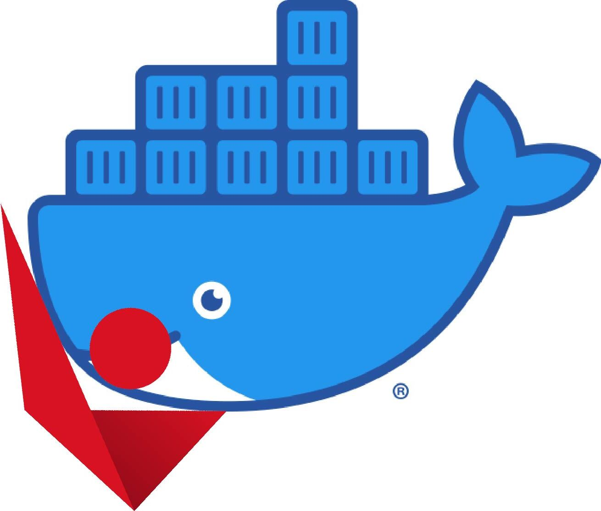

# Interactive Brokers Gateway/TWS Docker

<p align="center">
  
</p>

[](https://github.com/DankLabDev/ib-docker/actions/workflows/release.yml)
[](https://github.com/DankLabDev/ib-docker/actions/workflows/build_gateway.yml)
[](https://github.com/DankLabDev/ib-docker/actions/workflows/build_tws.yml)

Reliable, high-performance Docker images for running Interactive Brokers Gateway and TWS with full automation, SSH tunnel support, and robust process management.

## 🚀 Quick Start

**Images:** `danklabs/ib-gateway` • `danklabs/ib-tws`

```bash
# 1. Get the project
git clone https://github.com/your-repo/ib-docker.git
cd ib-docker

# 2. Configure credentials
cp .env.example .env
# Edit .env with your IB username and password

# 3. Start container
docker-compose up -d

# 4. Connect your trading app to localhost:4002 (paper) or localhost:4001 (live)
```

## ✨ Features

- **🔄 Full Automation** - [IBC](https://github.com/IbcAlpha/IBC) handles login and session management
- **🖥️ Headless Operation** - [Xvfb](https://www.x.org/releases/X11R7.6/doc/man/man1/Xvfb.1.xhtml) virtual display + [x11vnc](https://wiki.archlinux.org/title/x11vnc) for remote GUI access
- **🔒 Secure Access** - SSH tunneling for encrypted remote API connections
- **📊 Process Management** - [Supervisord](http://supervisord.org/) with auto-recovery and web monitoring
- **🌐 Flexible Networking** - Host networking, bridge mode, or SSH-only configurations
- **📈 Production Ready** - Health checks, logging, and high-availability patterns

## 📖 Documentation

| Guide | Description |
|-------|-------------|
| **[📚 Documentation Index](./docs/README.md)** | Complete documentation overview |
| **[🚀 Getting Started](./docs/GETTING_STARTED.md)** | Quick setup and installation |
| **[⚙️ Configuration](./docs/CONFIGURATION.md)** | Environment variables and settings |
| **[🔒 SSH Setup](./docs/SSH_SETUP.md)** | Secure remote access configuration |
| **[🌐 Networking](./docs/NETWORKING.md)** | Network architecture and patterns |
| **[🚢 Deployment](./docs/DEPLOYMENT.md)** | Production deployment scenarios |
| **[🔌 API Integration](./docs/API_INTEGRATION.md)** | Connect your trading applications |
| **[🛠 Troubleshooting](./docs/TROUBLESHOOTING.md)** | Diagnose and fix common issues |

## 🏗 Architecture

### Process Management with Supervisord

```
├── [settings] - Initialize IBC configuration
├── [xvfb] - Virtual display server
├── [x11vnc] - VNC server (optional)
├── [ibc] - IB Gateway/TWS
├── [socat] - Port forwarding (conditional)
└── [ssh-tunnel] - SSH tunnel (conditional)
```

**Benefits:**
- Auto-recovery of failed processes
- Web interface at `http://localhost:9001` (optional)
- Independent logging for each service
- Proper startup dependencies

## 🔗 Quick Configuration Examples

### Local Development
```yaml
services:
  ib-gateway:
    image: ib-gateway:latest
    network_mode: host
    environment:
      TRADING_MODE: paper
      ENABLE_SOCAT: "no"
      VNC_PWD: "password123"
```

### Remote Server (Secure)
```yaml
services:
  ib-gateway:
    image: ib-gateway:latest
    network_mode: host
    environment:
      SSH_TUNNEL: "yes"
      SSH_USER_TUNNEL: "trader@client.example.com"
      ENABLE_SOCAT: "no"
    volumes:
      - ~/.ssh:/home/ibuser/.ssh:ro
```

### External Access
```yaml
services:
  ib-gateway:
    image: ib-gateway:latest
    ports:
      - "4001:4003"
      - "4002:4004"
    environment:
      ENABLE_SOCAT: "yes"
```

## 🔌 API Access

| Program | Mode | Port | Description |
|---------|------|------|-------------|
| Gateway | Live | 4001 | Live trading API |
| Gateway | Paper | 4002 | Paper trading API |
| TWS | Live | 7496 | Live trading API |
| TWS | Paper | 7497 | Paper trading API |

## 🆘 Quick Help

### Check Status
```bash
# Container status
docker-compose ps

# Service status
docker-compose exec ib-gateway supervisorctl status

# Test connectivity
telnet localhost 4002
```

### Common Issues
- **API connection refused**: Check [Troubleshooting Guide](./docs/TROUBLESHOOTING.md)
- **SSH tunnel not working**: See [SSH Setup Guide](./docs/SSH_SETUP.md)
- **Container won't start**: Review [Getting Started](./docs/GETTING_STARTED.md)

### Useful Commands
```bash
# View logs
docker-compose logs -f ib-gateway

# Restart services
docker-compose exec ib-gateway supervisorctl restart ibc

# Run diagnostic test
./tests/test_ssh_tunnel.sh
```

## 🤝 Contributing

1. Review the [Documentation Index](./docs/README.md)
2. Test your changes thoroughly
3. Update relevant documentation
4. Submit a pull request

## 📄 License

This project is licensed under the MIT License - see the [LICENSE](LICENSE) file for details.

## ⚠️ Disclaimer

This software is for educational and research purposes. Users are responsible for compliance with Interactive Brokers' terms of service and applicable regulations. Always test with paper trading before using with real money.

Control container behavior through environment variables:

| Variable | Effect | Use Case |
|----------|--------|----------|
| `ENABLE_SOCAT=no` | Disables port forwarding | Host networking + localhost-only |
| `SSH_TUNNEL=yes` | SSH tunnel only | Maximum security |
| `SSH_TUNNEL=both` | SSH + local access | Hybrid deployment |
| `HTTP_SERVER_PORT=9001` | Enable supervisord web UI | Process monitoring |

## Network Access Patterns

Understanding when you need socat vs SSH tunnels:

### ✅ **No Socat Needed** (`ENABLE_SOCAT=no`)
- Host networking + localhost access only
- SSH tunnels for remote access
- Single-machine deployments

### ✅ **Socat Required** (`ENABLE_SOCAT=yes`)
- External machine access without SSH
- Bridge networking mode
- Port mapping requirements
## Configuration Examples

### 1. Local Development (Simplest)
```yaml
services:
  ib-gateway:
    network_mode: host
    environment:
      ENABLE_SOCAT: "no"
      IB_USER: ${IB_USER}
      IB_PASSWORD: ${IB_PASSWORD}
```
**Access:** `localhost:4001` (paper: `localhost:4002`)

### 2. Remote Server with SSH Tunnel (Most Secure)
```yaml
services:
  ib-gateway:
    network_mode: host
    environment:
      ENABLE_SOCAT: "no"
      SSH_TUNNEL: "yes"
      SSH_USER_TUNNEL: "user@client-machine.com"
      SSH_REMOTE_PORT: "4001"
    volumes:
      - ~/.ssh:/home/ibuser/.ssh:ro
```
**Access:** `localhost:4001` (on client machine via tunnel)

### 3. External Network Access
```yaml
services:
  ib-gateway:
    network_mode: host
    environment:
      ENABLE_SOCAT: "yes"
      # Exposes API on ports 4003/4004 for external access
```
**Access:** `server-ip:4003` (paper: `server-ip:4004`)

### 4. Bridge Networking (Docker Standard)
```yaml
services:
  ib-gateway:
    ports:
      - "4001:4003"
      - "4002:4004"
      - "5900:5900"
    environment:
      ENABLE_SOCAT: "yes"  # Required for bridge mode
```
**Access:** `localhost:4001` (Docker port mapping)

## SSH Tunnel Setup

### Quick Setup

1. **Generate SSH keys:**
   ```bash
   ssh-keygen -t ed25519 -f ~/.ssh/ib_tunnel
   ssh-copy-id -i ~/.ssh/ib_tunnel.pub user@server.com
   ```

2. **Configure container:**
   ```yaml
   environment:
     SSH_TUNNEL: "yes"
     SSH_USER_TUNNEL: "user@server.com"
   volumes:
     - ~/.ssh:/home/ibuser/.ssh:ro
   ```

3. **Access from client:**
   ```bash
   # API is now available at localhost:4001
   telnet localhost 4001
   ```

### SSH Environment Variables

| Variable | Description | Example |
|----------|-------------|---------|
| `SSH_TUNNEL` | `yes` (SSH only), `both` (SSH + local) | `yes` |
| `SSH_USER_TUNNEL` | SSH connection string | `user@server.com` |
| `SSH_REMOTE_PORT` | Remote port to expose | `4001` |
| `SSH_VNC_PORT` | Tunnel VNC port (optional) | `5900` |
| `SSH_PASSPHRASE` | SSH key passphrase | `your_passphrase` |

## Port Reference

| Program | Mode | Direct Port | Socat Port | Description |
|---------|------|-------------|------------|-------------|
| Gateway | Live | 4001 | 4003 | Live trading API |
| Gateway | Paper | 4002 | 4004 | Paper trading API |
| TWS | Live | 7496 | 7498 | Live trading API |
| TWS | Paper | 7497 | 7499 | Paper trading API |
| Both | - | 5900 | - | VNC server |

## Monitoring & Management

### Supervisord Web Interface

Enable the web interface to monitor all processes:

```yaml
environment:
  HTTP_SERVER_PORT: 9001
  HTTP_SERVER_USER: admin    # Optional
  HTTP_SERVER_PASS: secret   # Optional
```

**Access:** `http://localhost:9001`

### Command Line Management

```bash
# Check all process status
docker-compose exec ib-gateway supervisorctl status

# Restart a specific service
docker-compose exec ib-gateway supervisorctl restart ssh-tunnel

# View live logs
docker-compose exec ib-gateway supervisorctl tail -f ibc
```

## Additional Documentation

- **[SSH Setup Guide](./SSH_SETUP.md)** - Detailed SSH tunnel configuration
- **[Implementation Summary](./IMPLEMENTATION_SUMMARY.md)** - Technical architecture details

## Troubleshooting

### Common Issues

| Issue | Solution |
|-------|----------|
| **SSH tunnel not connecting** | Verify SSH keys mounted: `~/.ssh:/home/ibuser/.ssh:ro` |
| **API not accessible** | Check `ENABLE_SOCAT` setting and port configuration |
| **Container won't start** | Check `.env` file and supervisord logs |
| **Process keeps crashing** | Use `supervisorctl status` to identify failing service |

### Debugging Commands

```bash
# Check port usage
netstat -tlnp | grep -E ':(4001|4002|4003|4004)'

# Test API connection
telnet localhost 4001

# Check container processes
docker-compose exec ib-gateway ps aux

# Service management
docker-compose exec ib-gateway supervisorctl status
docker-compose exec ib-gateway supervisorctl restart ssh-tunnel
docker-compose exec ib-gateway supervisorctl tail -f ibc

# Container logs
docker-compose logs -f ib-gateway
```

### Security Best Practices

1. **SSH Tunnels**: Use Ed25519 keys with strong passphrases
2. **Network Access**: Prefer `SSH_TUNNEL=yes` over external socat exposure
3. **Credentials**: Use `.env` files, never commit passwords
4. **VNC**: Set strong `VNC_PWD` if enabling VNC server
5. **Monitoring**: Enable supervisord web interface only on trusted networks
