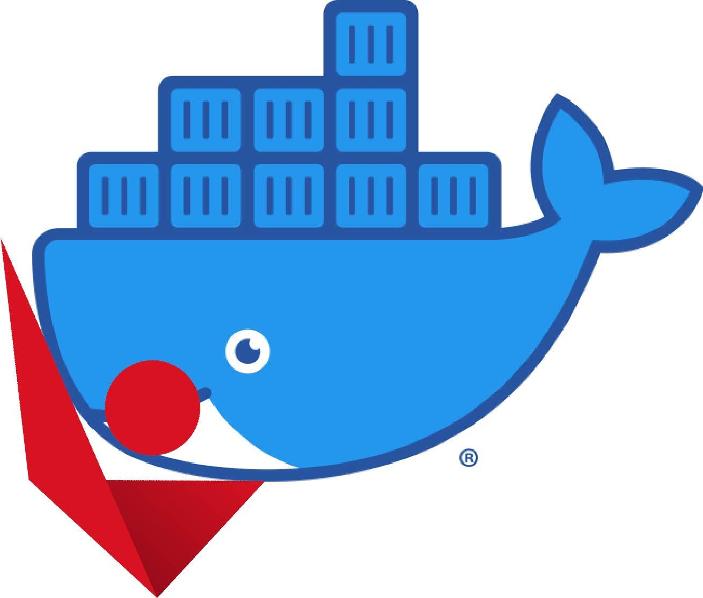

# Interactive Brokers Gateway/TWS Docker

<p align="center">
  
</p>

[](https://github.com/djkelleher/ib-docker/actions/workflows/release.yml)
[](https://github.com/djkelleher/ib-docker/actions/workflows/build_gateway.yml)
[](https://github.com/djkelleher/ib-docker/actions/workflows/build_tws.yml)

Reliable, high-performance Docker images for running Interactive Brokers Gateway and TWS with full automation and robust process management.

## 🚀 Quick Start

**Images:** `danklabs/ib-gateway` • `danklabs/ib-tws`

`IB_USER` and `IB_PASSWORD` must be provided. VNC is disabled unless `VNC_PWD` is set.

```bash
# 1. Get the project
git clone https://github.com/djkelleher/ib-docker.git
cd ib-docker

# 2. Configure credentials
cp .env.example .env
# Edit .env with your IB username and password

# 3. Start Gateway
docker compose up -d ib-gateway

# 4. Connect your trading app to localhost:4002 (paper) or localhost:4001 (live)
```

To run TWS instead of Gateway, start `ib-tws`. The compose file defines both
services for convenience, but start only the IB session you intend to use.

View process status & logs:
```bash
docker compose exec ib-gateway supervisorctl status
docker compose exec ib-gateway supervisorctl tail -f ibc
```

## ✨ Features

- **🔄 Full Automation** - [IBC](https://github.com/IbcAlpha/IBC) handles login and session management
- **🖥️ Headless Operation** - [Xvfb](https://www.x.org/releases/X11R7.6/doc/man/man1/Xvfb.1.xhtml) virtual display + [x11vnc](https://wiki.archlinux.org/title/x11vnc) for remote GUI access
- **📊 Process Management** - [Supervisord](http://supervisord.org/) with auto-recovery and per-process logs
- **🌐 Host Networking** - Uses the host network stack only for direct IB API access
- **📈 Production Ready** - Health checks, logging, and automatic process restart
- **🐳 Multi-stage Build** - All install logic embedded in `build/Dockerfile` (legacy `install.sh` removed)

### Process Management with Supervisord
**Benefits:**
- Auto-recovery of failed processes
- `supervisorctl` process status and log access
- Independent logging for each service
- Ordered startup for Xvfb, VNC, and IBC

## 🔧 Building Locally

```bash
# Build gateway (stable)
docker build -t danklabs/ib-gateway:stable \
  --build-arg PROGRAM=ibgateway --build-arg RELEASE=stable \
  --build-arg IB_VERSION=NULL --build-arg IB_INSTALLER_ARCH=x64 \
  --build-arg IBC_VERSION=3.23.0 build/

# Build TWS (stable)
docker build -t danklabs/ib-tws:stable \
  --build-arg PROGRAM=tws --build-arg RELEASE=stable \
  --build-arg IB_VERSION=NULL --build-arg IB_INSTALLER_ARCH=x64 \
  --build-arg IBC_VERSION=3.23.0 build/
```

Optional build args:
| ARG | Values | Purpose |
|-----|--------|---------|
| PROGRAM | ibgateway, tws | Select which app to install |
| RELEASE | stable, latest, beta | IB upstream release channel |
| IB_VERSION | NULL or numeric | Interactive Brokers release version. Use `NULL` for the current upstream channel installer, or a packaged release version from this project's GitHub releases |
| IB_INSTALLER_ARCH | x64 | IB installer artifact architecture; keep `x64` |
| IBC_VERSION | e.g. 3.23.0 | IBC release to bundle |

Gateway builds support `linux/amd64` and `linux/arm64` Docker platforms. TWS builds
are limited to `linux/amd64`.

## Host Networking Only

This project supports the host network stack only. The IB Gateway and TWS API
listeners are used directly on the host ports below, so each container should run
one service and one trading mode. To run live and paper at the same time, start
two containers with different service names and matching `TRADING_MODE` values.

```yaml
services:
  ib-gateway:
    image: danklabs/ib-gateway:stable
    network_mode: host
    environment:
      TRADING_MODE: paper
```
**Access:** `localhost:4002` for paper trading or `localhost:4001` for live trading.

## 🔐 Security Best Practices
1. **Credentials**: Use `.env` files or `*_FILE` secrets, never commit passwords
2. **VNC**: Set strong `VNC_PWD` if enabling VNC server
3. **Monitoring**: Use `supervisorctl` inside the container for process status and logs
4. **Updates**: Regularly update container images and dependencies

# Configuration Guide

## Environment Variables Reference

### Basic Configuration
| Variable | Default | Description |
|----------|---------|-------------|
| `TRADING_MODE` | `paper` | Trading mode: `paper` or `live` |
| `ACCEPT_NON_BROKERAGE_WARNING` | `yes` | Auto-accept paper trading account warning dialog |
| `TIME_ZONE` | `UTC` | Login timezone passed to IBC/TWS settings |

### IB Credentials
| Variable | Required | Description |
|----------|----------|-------------|
| `IB_USER` / `IB_USER_FILE` | Yes | Interactive Brokers username, directly or from a file |
| `IB_PASSWORD` / `IB_PASSWORD_FILE` | Yes | Interactive Brokers password, directly or from a file |

### Display & VNC
| Variable | Default | Description |
|----------|---------|-------------|
| `VNC_PWD` / `VNC_PWD_FILE` | - | VNC server password, directly or from a file. VNC is disabled if neither is set |
| `VNC_PORT` | `5900` | Gateway VNC listen port |
| `TWS_VNC_PORT` | `5901` | TWS VNC listen port in the provided compose file |
| `VNC_SCREEN_DIMENSION` | `1600x1200x24` | VNC/Xvfb screen resolution |
| `DISPLAY` | `:1` | X11 display number |

### Startup Hooks
| Variable | Default | Description |
|----------|---------|-------------|
| `START_SCRIPTS` | - | Absolute directory path for executable `*.sh` scripts run before runtime config is rendered |
| `X_SCRIPTS` | - | Absolute directory path for executable `*.sh` scripts run after Xvfb is ready and before IBC starts |
| `IBC_SCRIPTS` | - | Absolute directory path for executable `*.sh` scripts run after IBC starts |

### Common IBC Configuration
| Variable | Default | Description |
|----------|---------|-------------|
| `READ_ONLY_API` | `no` | Enable read-only API mode |
| `TWOFA_TIMEOUT_ACTION` | `exit` | Action on 2FA timeout: `exit` or `restart` |
| `SECOND_FACTOR_DEVICE` | - | Named second-factor device for IBC to select |
| `SECOND_FACTOR_AUTH_TIMEOUT` | `180` | IB second-factor timeout in seconds |
| `AUTO_RESTART_TIME` | - | Daily restart time (HH:MM AM/PM) |
| `AUTO_LOGOFF_TIME` | - | Daily logoff time (HH:MM AM/PM) |
| `COLD_RESTART_TIME` | - | Sunday cold restart time |
| `CLOSEDOWN_AT` | - | Tidy closedown time, optionally with day of week |
| `BYPASS_WARNING` | `yes` | Bypass API warning dialogs |
| `SAVE_TWS_SETTINGS` | `Every 30 mins` | TWS settings save schedule |
| `RELOGIN_AFTER_TWOFA_TIMEOUT` | `no` | Auto-relogin after 2FA timeout |
| `TWOFA_EXIT_INTERVAL` | `60` | 2FA timeout interval (seconds) |
| `EXISTING_SESSION_DETECTED_ACTION` | `manual` | IBC action for an existing session dialog |
| `ACCEPT_INCOMING_CONNECTION_ACTION` | `manual` | IBC action for incoming API connection dialogs |
| `ALLOW_BLIND_TRADING` | `no` | Dismiss blind-trading warning dialogs |
| `OVERRIDE_TWS_MASTER_CLIENT_ID` | - | Override TWS/Gateway master client ID |

### Advanced IBC Configuration
These variables map directly to settings in `build/config/ibc.ini`.

| Variable | Default |
|----------|---------|
| `FIX` | `no` |
| `FIX_LOGIN_ID` | - |
| `FIX_PASSWORD` | - |
| `EXIT_AFTER_TWOFA_TIMEOUT` | `no` |
| `LOGIN_DIALOG_DISPLAY_TIMEOUT` | `60` |
| `IB_DIR` | - |
| `STORE_SETTINGS_ON_SERVER` | `yes` |
| `MINIMIZE_MAIN_WINDOW` | `no` |
| `OVERRIDE_TWS_API_PORT` | - |
| `READ_ONLY_LOGIN` | `no` |
| `ACCEPT_BID_ASK_LAST_SIZE_DISPLAY_UPDATE` | - |
| `SEND_MARKET_DATA_IN_LOTS_FOR_US_STOCKS` | - |
| `TRUSTED_TWS_API_CLIENT_IPS` | - |
| `RESET_ORDER_IDS_AT_START` | - |
| `CONFIRM_ORDER_ID_RESET` | - |
| `CONFIRM_CRYPTO_CURRENCY_ORDERS` | `manual` |
| `DISMISS_PASSWORD_EXPIRY_WARNING` | `no` |
| `DISMISS_NSE_COMPLIANCE_NOTICE` | `yes` |
| `INCLUDE_STACK_TRACE_FOR_EXCEPTIONS` | `yes` |
| `COMMAND_SERVER_PORT` | `0` |
| `CONTROL_FROM` | - |
| `BIND_ADDRESS` | - |
| `COMMAND_PROMPT` | - |
| `SUPPRESS_INFO_MESSAGES` | `yes` |
| `LOG_STRUCTURE_SCOPE` | `known` |
| `LOG_STRUCTURE_WHEN` | `never` |

### Ports
The Dockerfile does not declare `EXPOSE` metadata because this project runs with
`network_mode: host`, and the active VNC port is selected at runtime.

| Service | Port | Description |
|---------|------|-------------|
| Gateway Live | 4001 | Live trading API |
| Gateway Paper | 4002 | Paper trading API |
| TWS Live | 7496 | Live trading API |
| TWS Paper | 7497 | Paper trading API |
| Gateway VNC | 5900 | Remote desktop access when `VNC_PWD` is set |
| TWS VNC | 5901 | Remote desktop access in the provided compose file when `VNC_PWD` is set |

## 🔌 API Access (Summary)
Same as Ports table above. The compose file uses `network_mode: host`, so it
does not define `ports` mappings; connect to the host API ports directly.

### JVM Tuning
| Variable | Default | Description |
|----------|---------|-------------|
| `JAVA_HEAP_SIZE` | auto | Fixed maximum heap size. Supports whole MB values, `m`, or `g` suffixes |
| `CUSTOM_JVM_OPTS` | - | Extra JVM options parsed with shell-style quoting |

```bash
# Set a fixed heap, or leave empty to auto-size from container memory.
JAVA_HEAP_SIZE=2g
CUSTOM_JVM_OPTS="-XX:+UseG1GC"
```

## Startup Customization

Startup hook directories are optional. When set, each variable must point to an
absolute directory path. Executable `*.sh` files in that directory run in sorted
order; non-executable scripts or failing scripts fail container startup.

Use hooks for deployment-local setup such as installing mounted certificates,
writing small generated config fragments, or emitting readiness notifications.
Keep the core IB session model to one service and one trading mode per
container; use separate containers for live and paper sessions.

## 🗑️ Legacy Cleanup Note
The historical `build/install.sh` helper script has been removed. All install logic is now implemented directly inside the multi-stage `build/Dockerfile` (builder stage). This reduces duplication and ensures reproducible builds.

## 📄 License
MIT

## 🙌 Contributions
Issues and PRs welcome. Please open an issue for feature discussions first.
